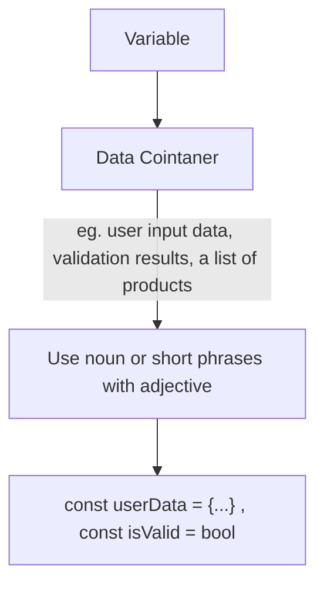
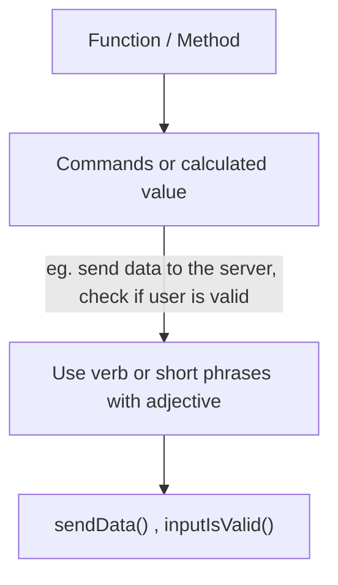
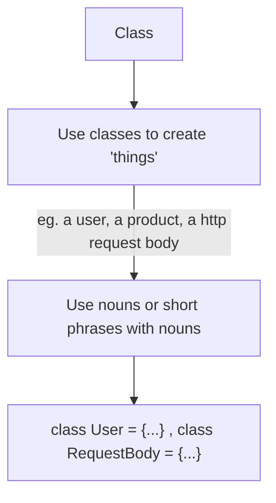

# Section 2: Naming - Assigning Names to Variables, Functions, Classes & More

## Why Good Names Matter
Actually name of variable, function and etc. should be meaningful. It helps other who read our code code can easily understand without even dive detail into the code itself.
 
Example:
  
    1. `const user = new(User)`
  
    2. `database.insert(user)`
  
    3. `if (isLoggedIn) {...}`
  
Examples above can make us easily understand what each code process without ever looking at the entire code inside the function. So it helps reducing _**cognitive load**_.

 

## How to Name Correctly
- Variable

 

- Function and Method

 

- Class

 
But all the above charts just the rules, you need to choose verbs, nouns, or adjectives by your own.

 

## Casing Conventions and Programming Languages
Commonly there are four casing style in programming. They are:

1. `snake_case` .. eg. `is_valid` , `send_response` .. usage example in **python** as variables and functions/methods naming. 

2. `camelCase` .. eg. `isValid` , `sendResponse` .. usage example in **java or javascript** as variables and functions/methods naming.

3. `PascalCase` .. eg. `AdminRole` , `UserRepository` .. usage example in **many programming languages** as classes name.

4. `kebab-case` .. eg. `<side-drawer>` .. usage example in **html** as custom html elements.

You may see the differences between each others.

> **NOTE:** I mentioned programming language that use that casing style, but it does not mean other programming languages (that I have not mentioned) does not have those styles of casing. So explore the casing style of each by read docs and codes of the community of each programming languages. Because following the languages' conventions is also the part of writing a clean code.

 

## Naming Variables and Properties Theory

| Value of an Object | Value is Number or String | Value is a boolean |
|--|--|--|
| Describe the Value | Describe the Value | Answer a true/false question |
| `user`   `database` | `name`   `age` | `isActive`   `loggedIn` |
| Provide more details without introducing redundancy | Provide more details without introducing redundancy | Provide more details without introducing redundancy |
| `authenticatedUser`   `sqlDatabase` | `firstName`   `age` (it has been specific) | `isActiveUser`   `loggedIn` |

 

example:
| What is stored? | Bad Names | Okay Names | Good Names |
|--|--|--|--|
| A user object (name, email, age) | `u`   `data`  (not specific and "u" and "data" could contain anything) | `userData`   `person`   ("userData" is a bit redundant, and "person" is too unspecific) | `user`   `customer`   ("user" is descriptive enough, and "customer" is even more specific) |
| User input validation result (true/false) | `v`   `val`   ("v" is could be anything and "val" could stand for value instead of validation) | `correct`   `validatedInput`   (both terms do not necessarily imply a true/false value) | `isCorrect`   `isValid`   `isInputValid`   (those terms are descriptive and have clear value types) |

> **NOTE:** Avoid to name something not specific. 

