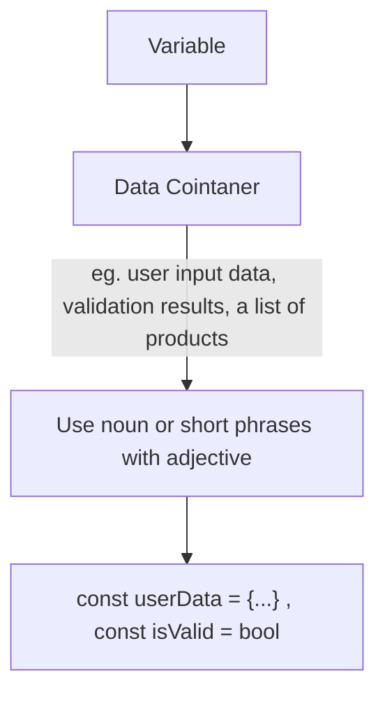
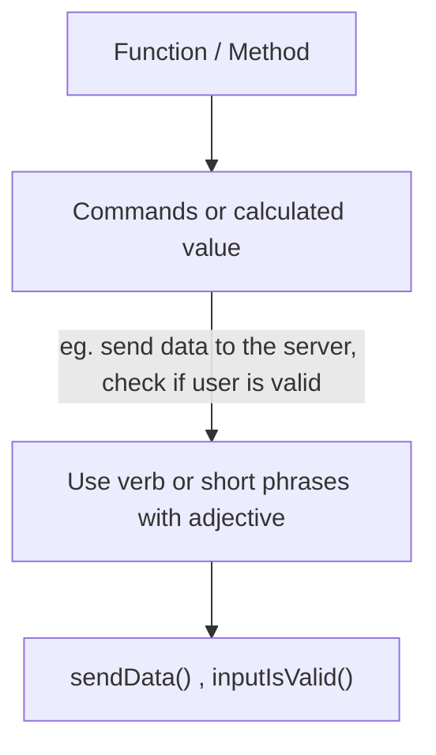
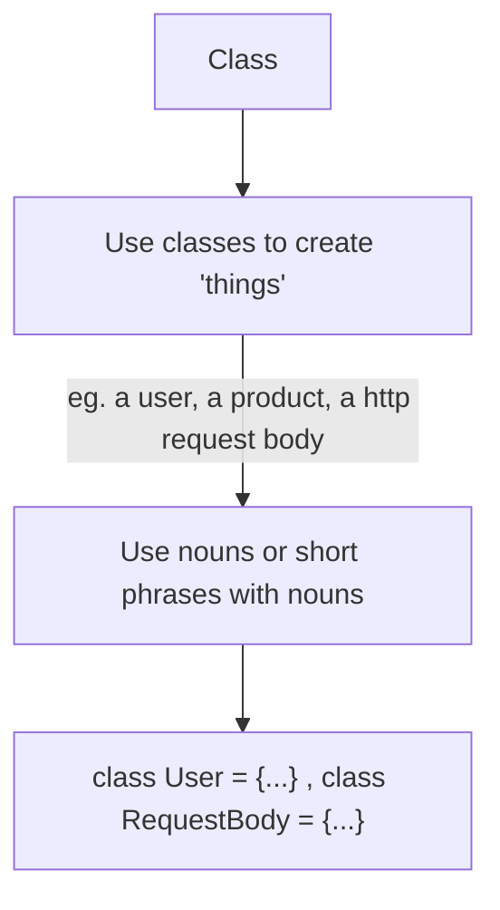

# Section 2: Naming - Assigning Names to Variables, Functions, Classes & More

## Why Good Names Matter
Actually name of variable, function and etc. should be meaningful. It helps other who read our code code can easily understand without even dive detail into the code itself.
 
Example:
  
    1. `const user = new(User)`
  
    2. `database.insert(user)`
  
    3. `if (isLoggedIn) {...}`
  
Examples above can make us easily understand what each code process without ever looking at the entire code inside the function. So it helps reducing _**cognitive load**_.

 

## How to Name Correctly
- Variable

 

- Function and Method

 

- Class

 
But all the above charts just the rules, you need to choose verbs, nouns, or adjectives by your own.

 

